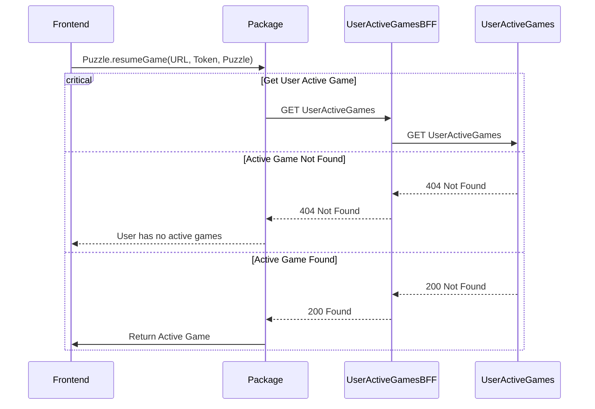
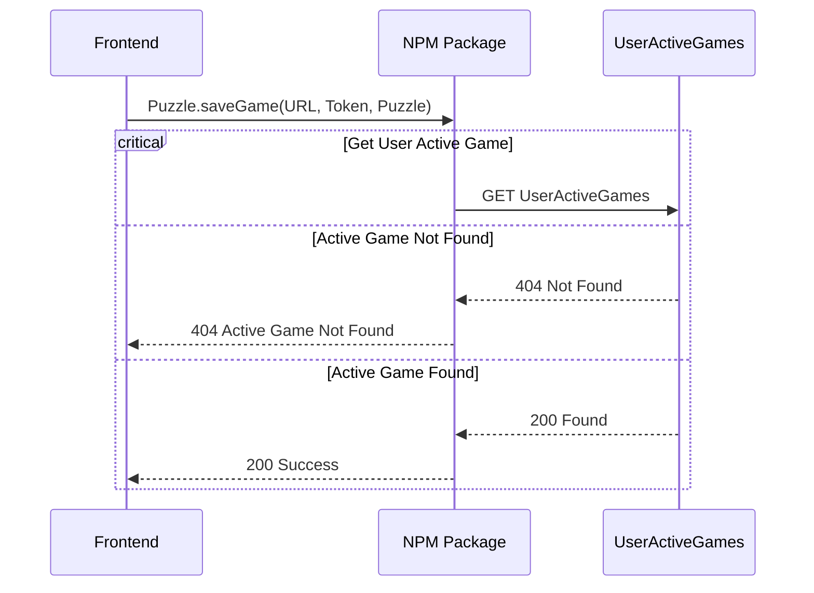
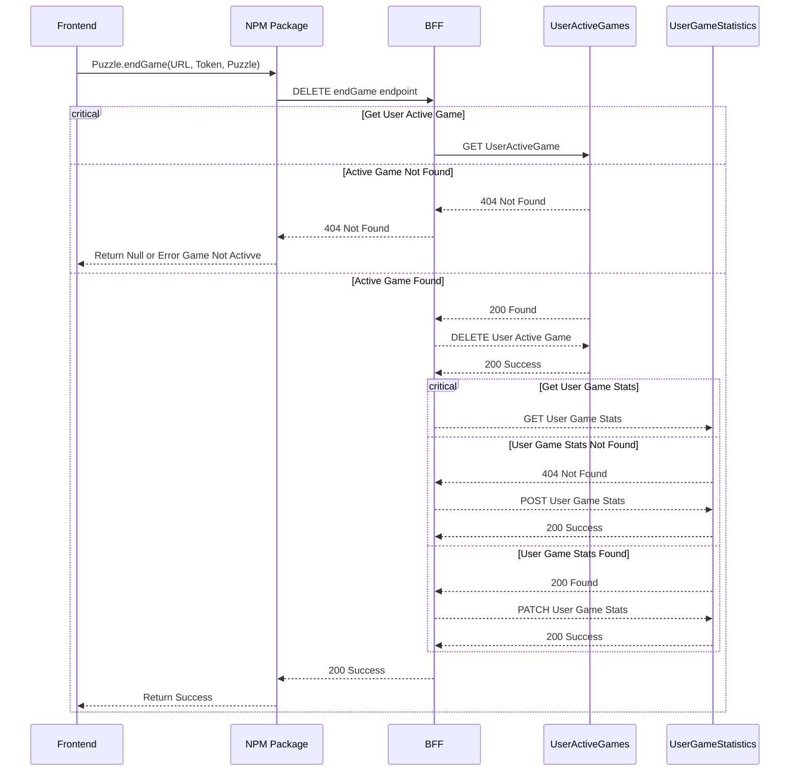

### These diagrams do not consider 400, 401, or 500 errors for simplicity. They only consider 404, 200/201 error codes. 


### Flow to get User Game Preferences
<!-- 
```mermaid
sequenceDiagram
    participant Frontend
    participant NPM Package
    participant BFF
    participant UserGamePreferences
    
    #Get User Game Preferences
    Frontend->>NPM Package: Puzzle.getUserGamePreferences(URL, Token, Parameters)
    NPM Package->>BFF: Get userGamePreferences endpoint
    
    critical Get User Game Search Preferences
        BFF->> -->

### Flow to update User Game Preferences


### Flow for the frontend to start a game

```mermaid
sequenceDiagram
    participant Frontend
    participant NPM Package
    participant BFF
    participant UserGamePreferences
    participant Puzzle
    participant UserGameStatistics
    participant UserActiveGames
    
    #Start Game
    Frontend->>NPM Package: Puzzle.startGame(URL, Token, Parameters)
    NPM Package->>BFF: GET startGame endpoint

    critical Get User Game Search Preferences
        BFF->>UserGamePreferences: GET User Game Preferences
    option User Game Search Preferences Not Found
        UserGamePreferences-->>BFF: 404 Not Found
        BFF-->>UserGamePreferences: POST Create User Search Preferences
    option User Game Search Preferences Found
        UserGamePreferences-->>BFF: 200 Found
    end

    critical Get Puzzle
        BFF->>Puzzle: GET Puzzle
    option Puzzle Not Found
        Puzzle-->>BFF: 404 Not Found
        BFF-->>NPM Package: 404 Not Found
        NPM Package-->>Frontend: Return Null or Error Invalid Search Criteria
    option Puzzle Found
        Puzzle-->>BFF: 200 Found
        critical Get User Game History
            BFF-->>UserGameStatistics: GET User Game Statistics
        option User Game Statistics Not Found
            UserGameStatistics-->>BFF: 404 Not Found
            BFF-->>UserGameStatistics: POST User Game Statistics
        option User Game Statistics Found
            UserGameStatistics-->>BFF: 200 Found
        end
        BFF->>UserActiveGames: POST User Active Game
        UserActiveGames->>BFF: 200 Success
        BFF-->>NPM Package: Return Puzzle Object
        NPM Package-->>Frontend: Return Puzzle Object
    end
```

### Flow for the frontend to resume a game



### Flow for the frontend to save a game



### Flow for frontend to end a game


