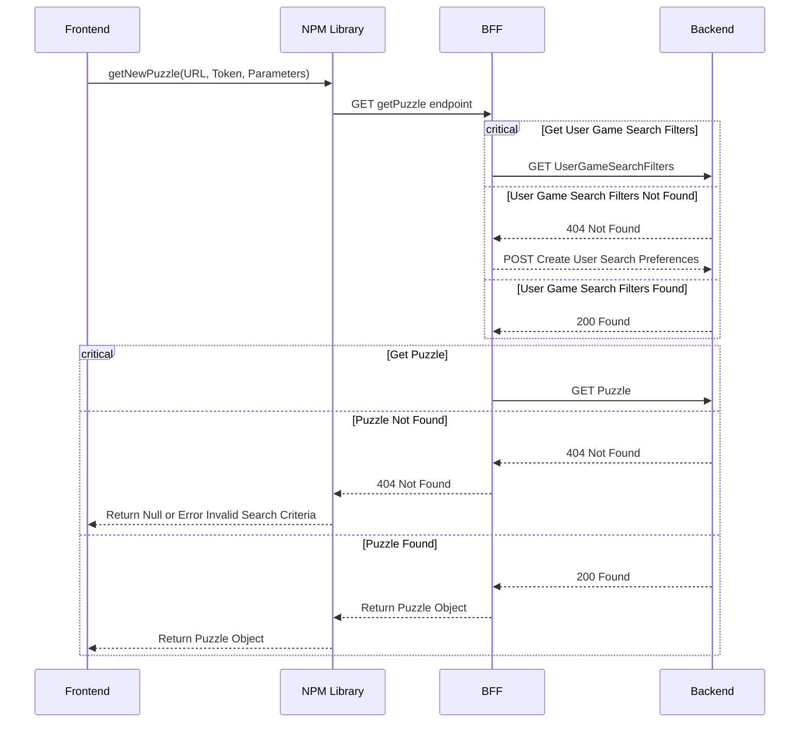
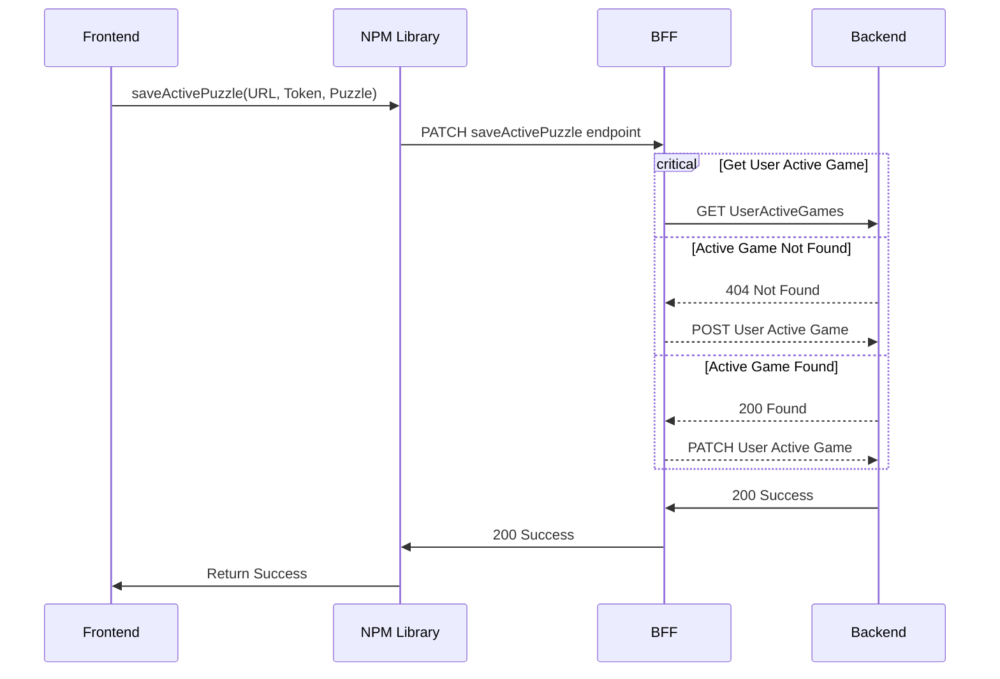
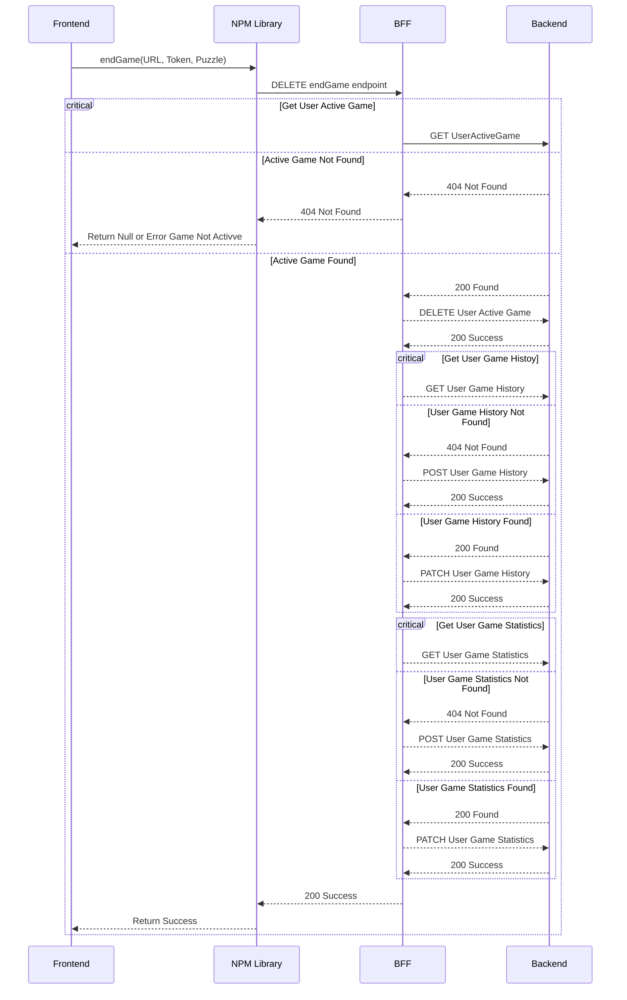

### Flow for the frontend to get a puzzle

### Flow for the frontend to save an active puzzle

### Flow for frontend to end game

TODO: Combine GameHistory and GameObject into one MongoDB object using Bucket strategy!

