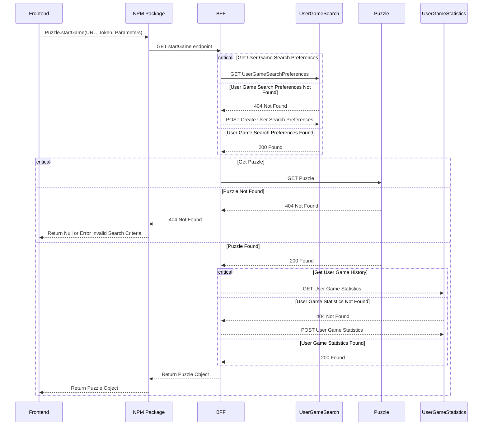
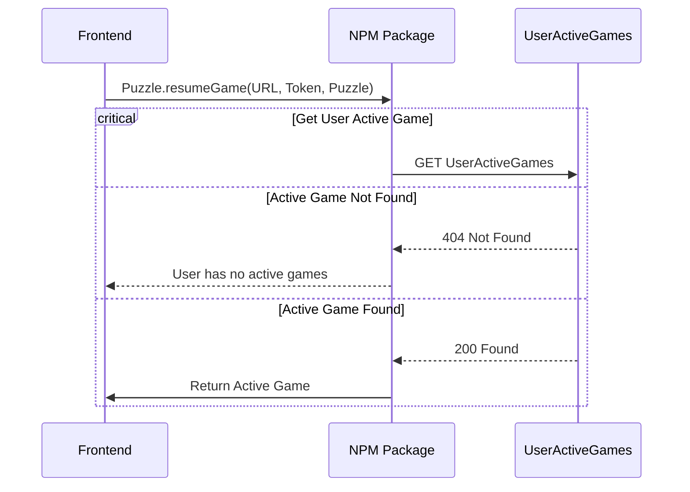
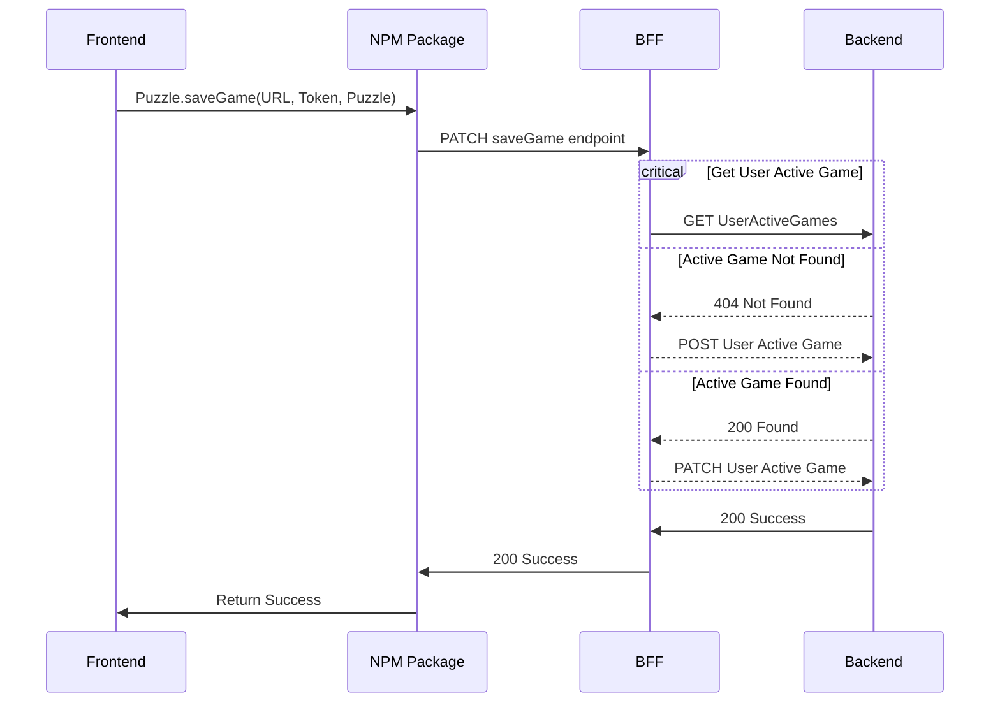

### These diagrams do not consider 400, 401, or 500 errors for simplicity. They only consider 404, 200/201 error codes. 

### Flow for the frontend to start a game

### Flow for the frontend to resume a game

### Flow for the frontend to save a game

### Flow for frontend to end a game

